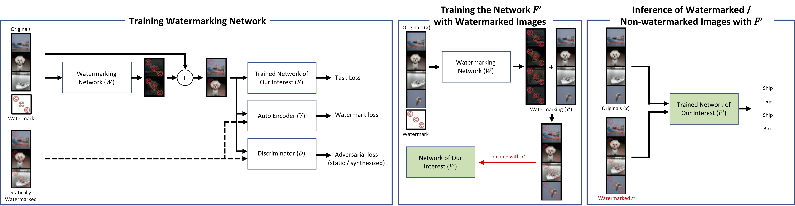
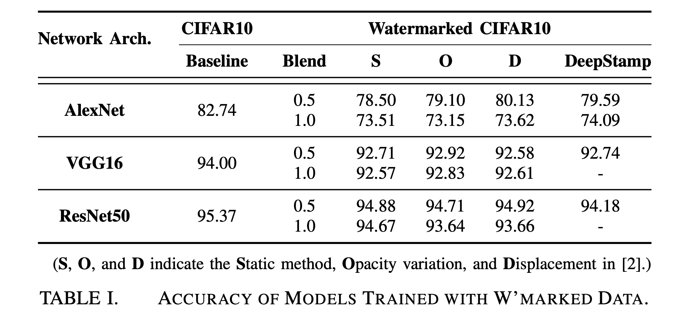

# Project: DeepStamp

**Poster: On the Feasibility of Training Neural Networks with Visibly Watermarked Dataset**

DeepStamp is a framework for visible-watermarking. Given a watermark and a trained network for a task, our framework learns how to synthesize a watermarked image that is human-perceptible, robust to removals, and able to be used as training images for the recognition with minimal accuracy loss. We leverage the generative multi-adversarial network (GMAN).

This repository is for the following poster article:

*Poster: On the Feasibility of Training Neural Networks with Visibly Watermarked Dataset.* </br>
*[Sanghyun Hong](http://sanghyun-hong.com), Tae-hoon Kim, [Tudor Dumitraș](http://users.umiacs.umd.edu/~tdumitra/), and Jonghyun Choi.* </br>
[1902.10854](https://arxiv.org/abs/1902.10854)

----

## 1. Runtime Environment

 - Ubuntu 16.04
 - Python 3.7.3
 - PyTorch 1.0

----

## 2. Threat Model

We consider an attacker who claims the ownership of
the datasets produced or collected by others, e.g, industrial
partners or public parties.

----

## 3. DeepStamp Framework



Given a watermark and dataset, **DeepStamp** produces a watermarked dataset with the synthesized watermark specifically designed for each data in the dataset. The dataset with the synthesized watermarks can: (1) achieve the minimal accuracy drop of models trained on the dataset (compared to the models trained with the original dataset), (2) makes the watermarks in each data robust to removal attempts by attackers, and (3) still makes the watermarks perceptible to human-eyes.

Our framework is illustrated in the above figure: DeepStamp trains a generative network (*W*) that produces a specific watermark for each data in a dataset. Once the watermark is blended to data, the watermarked data minimizes the classification loss of the model (*F*) trained with the original data; produces the similar outputs to the original data when it's fed to an auto-encoder (*V*); and is hard to be distinguished by a discriminator (*D*). We leverage **Generative Multi-Adversarial Network (GMAN)** to train all the networks jointly.

### 3.1. Train a Network

To start with, we train a network for a predefined task with the original dataset (w/o watermarks). This model will be used as *F* in GMAN. [Note that we currently support AlexNet, VGG16, and ResNet50 for CIFAR-10.]

      $ ./train.sh
      $ python train.py <with the command line arguments>

*Optional: to compute the validation accuracy of the trained model*

      $ ./valid.sh
      $ python valid.py <with the command line arguments>


### 3.2. Train Generative Multi-Adversarial Network (GMAN)

DeepStamp trains a watermarking network (*W*) jointly with the attached discriminators by leveraging GMAN. The discriminators realize the watermark conditions that we aims to achieve. After the training process, we have the watermarking network, the watermarked dataset, and the rests.

      $ ./train_wmark.sh
      $ python train_wmark.py <with the command line arguments>

*[Note: the watermarked dataset will be stored into the 'datasyn' folder, the watermarking network will be under 'models', and figures/results are under the 'figures/results' directories]*


### 3.3 Train the Same Network with the Watermarked Dataset

With the trained watermarked dataset, we train the network (*F'*) used in Step 3.1 until we achieve a similar accuracy on the test dataset. Here, the test dataset that we used does not include any watermark; thus, we ensure the closest accuracy when the model is deployed.

      $ ./train.sh
      $ python train.py --dataset custom --datapth <datasyn/...> <other command line arguments>

The trained model will have a similar overall accuracy on the watermarked and non-watermarked validation dataset. This enables us to release the watermarked training dataset instead of distributing the original training data. Also, each watermarked data includes the different blending pattern; thus, an attacker requires a non-trivial effort to remove each watermark from a data.

      $ ./valid.sh
      $ python valid.py <with the command line arguments>

### [Optional] 3.4 Transform the Dataset with Different Watermark Methods

To compare our watermark scheme with the schemes in the CVPR'17 paper, we apply the watermark methods considered in the paper and produces the watermarked datasets. The paper considers the *static method*, *opacity variation*, and *spatial perturbation*.

      $ python transform.py <with the command line arguments>

----

## 4. Experimental Results



- **Visible watermarking causes the overall accuracy drops in all cases**; however, if the network capacity (the number of parameters in a network) is larger, the accuracy drop is less.

- **When we use a strong blending factor (1.0), the overall accuracy drop increases.** However, the drops are not significant with the high-capacity networks such as ResNet50.

- **Using AlexNet, the data with synthesized watermark has a less accuracy drop than the statically watermarked data (S).** Nevertheless, we are not better when the watermarked data with displacements (D) is used.

- By training VGG16 or ResNet50 with the watermarked data using AlexNet, we observe accuracy drops by 1.17% and 0.74% compared to the static (S) method. **Since the drops are similar to the case in which we use the same networks, once synthesized, the data can be used to train multiple networks.**

----

## Cite This Work

You are encouraged to cite our article if you use **DeepStamp** for academic research.

```
@inproceedings{Hong19DeepStamp,
  author    = {Sanghyun Hong and
               Tae-hoon Kim and
               Tudor Dumitra\cb{s} and
               Jonghyun Choi},
  title     = {Poster: On the Feasibility of Training Neural Networks with Visibly Watermarked Dataset},
  booktitle = {26nd Annual Network and Distributed System Security Symposium, {NDSS}
               2019, San Diego, California, USA, February 24-27, 2019},
  publisher = {The Internet Society},
  year      = {2019},
  url       = {https://arxiv.org/abs/1902.10854},
}
```

**Fin.**
